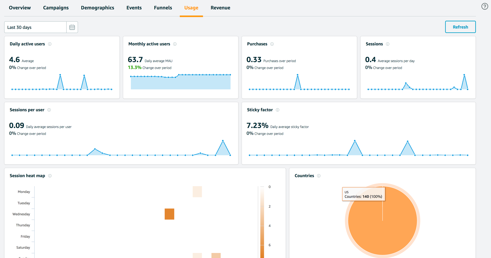

# Add Analytics to Your Mobile App with Amazon Pinpoint

## Pinpoint

Gather the data that helps improve your app's usability, monetization, and engagement with your users. The CLI deploys your analytics backend using [Amazon Pinpoint](http://docs.aws.amazon.com/pinpoint/latest/developerguide/welcome.html).

### Set Up Your Backend

1. Complete the [Get Started TODO link](asdf) steps before you proceed.

2. Use the CLI to add analytics to your cloud-enabled backend and app.

    In a terminal window, navigate to your project folder (the folder that typically contains your project level `build.gradle`), and add the SDK to your app.

    ```bash
    $ cd ./YOUR_PROJECT_FOLDER
    $ amplify add analytics
    ```

    In a terminal window, navigate to your project folder (the folder contains your app :file:`.xcodeproj` file), and add the SDK to your app.

    ```bash
    $ cd ./YOUR_PROJECT_FOLDER
    $ amplify add analytics
    ```

3. When configuration for analytics is complete, a message appears confirming that you have configured local CLI metadata for this category. You can confirm this by viewing status.

    ```bash
           $ amplify status
          | Category  | Resource name   | Operation | Provider plugin   |
          | --------- | --------------- | --------- | ----------------- |
          | Auth      | cognitoabcd0123 | Create    | awscloudformation |
          | Analytics | yourprojectname | Create    | awscloudformation |
    ```

4. To create your backend AWS resources run the following:

    ```bash
    $ amplify push
    ```

### Connect to Your Backend

Use the following steps to add analytics to your mobile app and monitor the results through Amazon Pinpoint.

#### Add Analytics

1. Set up AWS Mobile SDK components by including the following libraries in your `app/build.gradle` dependencies list.

    ```groovy
    dependencies {
      implementation 'com.amazonaws:aws-android-sdk-pinpoint:2.6.+'
      implementation ('com.amazonaws:aws-android-sdk-mobile-client:2.6.+@aar') { transitive = true }
    }
    ```

    * `aws-android-sdk-pinpoint` library enables sending analytics to Amazon Pinpoint.
    * `aws-android-sdk-mobile-client` library gives access to the AWS credentials provider and configurations.

2. Add required permissions to your app manifest.

    The AWS Mobile SDK requires the `INTERNET` and `ACCESS_NETWORK_STATE` permissions. These are defined in the `AndroidManifest.xml` file.

    ```xml
    <uses-permission android:name="android.permission.INTERNET"/>
    <uses-permission android:name="android.permission.ACCESS_NETWORK_STATE"/>
    ```

3. Add calls to capture session starts and stops. A session is one use of an app by the user. A session begins when an app is launched (or brought to the foreground), and ends when the app is terminated (or goes to the background). To accommodate for brief interruptions, like a text message, an inactivity period of up to 5 seconds is not counted as a new session. :guilabel:`Total daily sessions` shows the number of sessions your app has each day. :guilabel:`Average sessions per daily active user` shows the mean number of sessions per user per day.

   The following are typical places where you can instrument your app session start and stop:

   * Start a session in the :code:`Application.onCreate()` method.

   * Start a session in the :code:`onCreate()` method of the app's first activity.

   * Start or stop a session in the `ActivityLifecycleCallbacks <https://developer.android.com/reference/android/app/Application.ActivityLifecycleCallbacks>`__ class.

   The following example shows how to start a session in the :code:`OnCreate` event of :code:`MainActivity`.

    ```java
    import android.support.v7.app.AppCompatActivity;
    import android.os.Bundle;

    import com.amazonaws.mobileconnectors.pinpoint.PinpointManager;
    import com.amazonaws.mobileconnectors.pinpoint.PinpointConfiguration;
    import com.amazonaws.mobile.client.AWSMobileClient;

    public class MainActivity extends AppCompatActivity {
        private static final String TAG = MainActivity.class.getSimpleName();

        public static PinpointManager pinpointManager;

        @Override
        protected void onCreate(Bundle savedInstanceState) {
            super.onCreate(savedInstanceState);
            setContentView(R.layout.activity_main);

            // Initialize the AWS Mobile Client
            AWSMobileClient.getInstance().initialize(this, new AWSStartupHandler() {
                @Override
                public void onComplete(AWSStartupResult awsStartupResult) {
                    Log.d(TAG, "AWSMobileClient is instantiated and you are connected to AWS!");
                }
            }).execute();

            PinpointConfiguration config = new PinpointConfiguration(
                    MainActivity.this,
                    AWSMobileClient.getInstance().getCredentialsProvider(),
                    AWSMobileClient.getInstance().getConfiguration()
            );
            pinpointManager = new PinpointManager(config);
            pinpointManager.getSessionClient().startSession();
        }
    }
    ```

	To stop the session, use :code:`stopSession()` and :code:`submitEvents()` at the last point in the session you want to capture. In this example, we are using a single Activity, so the session will stop when the MainActivity is destroyed. :code:`onDestroy()` is usually called when the back button is pressed while in the activity.
	
	```java
	@Override
	protected void onDestroy() {
	    super.onDestroy();
	
	    pinpointManager.getSessionClient().stopSession();
	    pinpointManager.getAnalyticsClient().submitEvents();
	}
	```

#### Monitor Analytics

Build and run your app to see usage metrics in Amazon Pinpoint. When you run the previous code samples, the console shows a logged Session.

1. To see visualizations of the analytics coming from your app, open your project in the Amazon Pinpoint console by running the following:

    ```bash
    $ amplify console analytics
    ```

2. Choose `Analytics` from the icons on the left of the console, and view the graphs of your app's usage. It may take up to 15 minutes for metrics to become visible.

    

    [Learn more about Amazon Pinpoint](http://docs.aws.amazon.com/pinpoint/latest/developerguide/welcome.html).

### Enable Custom App Analytics

Instrument your code to capture app usage event information, including attributes you define.  Use graphs of your custom usage event data  in the Amazon Pinpoint console. Visualize how your users' behavior aligns with a model you design using [Amazon Pinpoint Funnel Analytics](https://docs.aws.amazon.com/pinpoint/latest/userguide/analytics-funnels.html), or use [stream the data](https://docs.aws.amazon.com/pinpoint/latest/userguide/analytics-streaming.html) for deeper analysis.

Use the following steps to implement Amazon Pinpoint custom analytics for your app.

```java
import com.amazonaws.mobileconnectors.pinpoint.analytics.AnalyticsEvent;

/**
* Call this method to log a custom event to the analytics client.
*/
public void logEvent() {
   final AnalyticsEvent event =
       pinpointManager.getAnalyticsClient().createEvent("EventName")
           .withAttribute("DemoAttribute1", "DemoAttributeValue1")
           .withAttribute("DemoAttribute2", "DemoAttributeValue2")
           .withMetric("DemoMetric1", Math.random());

   pinpointManager.getAnalyticsClient().recordEvent(event);
}
```

Build, run, and use your app. Then, view your custom events on the `Events` tab of the Amazon Pinpoint console (choose `Analytics`>`Events`). Look for the name of your event in the `Events` menu.

### Enable Revenue Analytics

Amazon Pinpoint supports the collection of monetization event data. Use the following steps to place
and design analytics related to purchases through your app.

```java
import com.amazonaws.mobileconnectors.pinpoint.analytics.monetization.AmazonMonetizationEventBuilder;

/**
* Call this method to log a monetized event to the analytics client.
*/
public void logMonetizationEvent() {
    final AnalyticsEvent event =
       AmazonMonetizationEventBuilder.create(pinpointManager.getAnalyticsClient())
           .withCurrency("USD")
           .withItemPrice(10.00)
           .withProductId("DEMO_PRODUCT_ID")
           .withQuantity(1.0)
           .withProductId("DEMO_TRANSACTION_ID").build();

    pinpointManager.getAnalyticsClient().recordEvent(event);
}
```

## Kinesis

