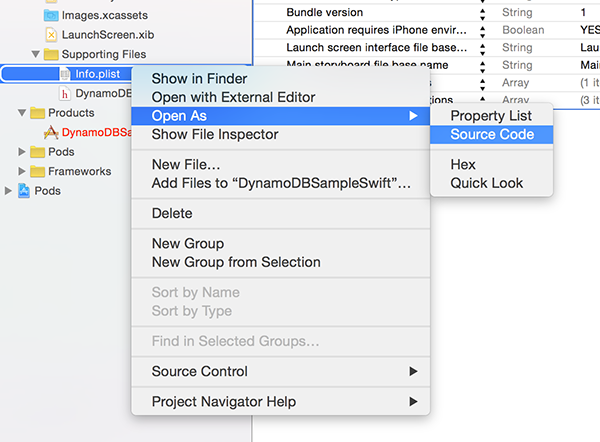

# iOS: Preparing Your App to Work with ATS

If you use the iOS 9 SDK (or Xcode 7) or later, the Apple [App Transport Security (ATS)](https://developer.apple.com/library/prerelease/ios/technotes/App-Transport-Security-Technote/)
feature might impact how your apps interact with some AWS services.

If your app targeted for iOS 9+ attempts to connect to an AWS service endpoint that does not yet meet all the ATS requirements, the connection may fail. The following sections provide instructions to determine if your app is affected, and what steps to take to mitigate the impact of ATS on your app.

## Diagnosing ATS Conflicts

If your app stops working after being upgraded to Xcode 7 or later and iOS 9 or later, follow these steps to determine if it affected by ATS.

1. Turn on verbose logging of the AWS Mobile SDK for iOS by calling the following line in the ``- application:didFinishLaunchingWithOptions:`` application delegate.

```swift
@UIApplicationMain
class AppDelegate: UIResponder, UIApplicationDelegate {

    var window: UIWindow?
    func application(application: UIApplication, didFinishLaunchingWithOptions
    launchOptions: [UIApplicationLaunchOptionsKey: Any]?) -> Bool {
        ...
        AWSLogger.default().logLevel = .verbose
        ...

        return true
    }
}
```

2. Run your app and make a request to an AWS service.

3. Search your log output for "SSL". The message containing: "An SSL error has occurred and a secure connection to the server cannot be made" indicates that your app is affected by the ATS changes.

```
  2015-10-06 11:39:13.402 DynamoDBSampleSwift[14467:303540] CFNetwork SSLHandshake failed (-9824)
  2015-10-06 11:39:13.403 DynamoDBSampleSwift[14467:303540] NSURLSession/NSURLConnection HTTP load failed (kCFStreamErrorDomainSSL, -9824)
  2015-10-06 11:39:13.569 DynamoDBSampleSwift[14467:303540] CFNetwork SSLHandshake failed (-9824)
  2015-10-06 11:39:13.569 DynamoDBSampleSwift[14467:303540] NSURLSession/NSURLConnection HTTP load failed (kCFStreamErrorDomainSSL, -9824)
  Error: Error Domain=NSURLErrorDomain Code=-1200 "An SSL error has occurred and a secure connection to the server cannot be made." UserInfo={_kCFStreamErrorCodeKey=-9824, NSLocalizedRecoverySuggestion=Would you like to connect to the server anyway?, NSUnderlyingError=0x7fca343012f0 {Error Domain=kCFErrorDomainCFNetwork Code=-1200 "(null)" UserInfo={_kCFStreamPropertySSLClientCertificateState=0, _kCFNetworkCFStreamSSLErrorOriginalValue=-9824, _kCFStreamErrorDomainKey=3, _kCFStreamErrorCodeKey=-9824}}, NSLocalizedDescription=An SSL error has occurred and a secure connection to the server cannot be made., NSErrorFailingURLKey=https://dynamodb.us-east-1.amazonaws.com/, NSErrorFailingURLStringKey=https://dynamodb.us-east-1.amazonaws.com/, _kCFStreamErrorDomainKey=3}
```
   If you cannot find the SSL handshake error message, it is possible that another problem caused your app to stop working. Some internal behaviors change with major operating system updates, and it is common for previously unseen issues to surface.

   If you are unable to resolve such issues, you can post code snippets, and steps to reproduce the issue on [our forum](https://forums.aws.amazon.com/forum.jspa?forumID=88) or [GitHub](https://github.com/aws/aws-sdk-ios/issues) so that we can assist you in identifying the issue. Remember to include the versions of Xcode, iOS, and the AWS Mobile SDK.

## Mitigating ATS Connection Issues

If you determine that your app is impacted by the diagnostic handshake error, you can configure the app to interact properly with the ATS feature by taking the following steps to add properties to your ``Info.plist`` file.

1. Locate your ``Info.plist`` and from the context menu select **Open As** > **Source Code**.

    

2. Copy and paste the following key as a direct child of the top level ``<dict>`` tag.

```xml
<plist version="1.0">
  <key>NSAppTransportSecurity</key>
  <dict>
      <key>NSExceptionDomains</key>
      <dict>
          <key>amazonaws.com</key>
          <dict>
                <key>NSThirdPartyExceptionMinimumTLSVersion</key>
                <string>TLSv1.0</string>
                <key>NSThirdPartyExceptionRequiresForwardSecrecy</key>
                <false/>
                <key>NSIncludesSubdomains</key>
                <true/>
          </dict>
          <key>amazonaws.com.cn</key>
          <dict>
                <key>NSThirdPartyExceptionMinimumTLSVersion</key>
                <string>TLSv1.0</string>
                <key>NSThirdPartyExceptionRequiresForwardSecrecy</key>
                <false/>
                <key>NSIncludesSubdomains</key>
                <true/>
          </dict>
      </dict>
  </dict>

  . . .
</plist>
```

After following these steps, your app should be able to access AWS endpoints while running on iOS 9 or later.
